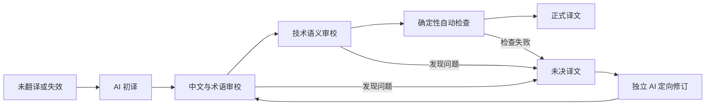

# Gmsh 中文文档翻译方案

- 状态：已确认
- 制定日期：2026-08-13
- 首个活动版本：Gmsh 4.15.2
- 目标语言：简体中文（`zh-CN`）
- 发布地址：`https://setupdata.github.io/gmsh-doc-cn/`

## 1. 目标和边界

本项目制作 Gmsh 官方参考手册的完整简体中文忠实译本。译文以固定的英文发布版本为准，完整翻译其中表达技术含义的自然语言，不删节，也不增加原文没有的教程或解释。中文采用中国大陆技术文档的常见写法，使用自然、完整的句子和中文标点；专有名词首次出现时可以写成“中文（English）”，API 名称和程序标识符始终保留英文。

下列内容属于可翻译内容：

- 章节标题、正文、图表标题、提示和说明；
- API 参数、返回值及用途的自然语言描述；
- 选项、字段、插件和文件格式的自然语言说明；
- 自然语言概念索引中的显示文字；
- `CHANGELOG` 中的版本说明和 `CREDITS` 中除姓名外的说明文字。

下列内容属于受保护内容，必须原样保留：

- Texinfo 命令、节点、锚点、交叉引用目标、索引关系和 include 关系；
- 所有示例代码、数学公式以及其中的注释；
- API、函数、类型、命名空间、选项、命令行参数和文件格式字段；
- 数值默认值、单位、文件名、作者姓名、外部链接和上游构建元数据；
- Gmsh 随附的英文许可证正文。

若英文原文存在错误、陈旧数值或歧义，中文仍忠实表达原文，并在独立的译者注中说明。译者注不得写入原文对应的 `msgstr`，也不得悄悄修正原文。

## 2. 上游来源和许可

首个版本固定使用 Gmsh 4.15.2 官方发布包，不跟随开发分支，也不运行 `gmsh -doc`、API 生成器或其他程序重新生成发布包中的文档。固定信息写入 `upstream/manifest.toml`：

| 项目 | 固定值 |
| --- | --- |
| Gmsh 版本 | `4.15.2` |
| Git 标签 | `gmsh_4_15_2` |
| Git 提交 | `657c8e915f60405e6cad0c8ec7faf812bfff1a60` |
| 源码包 | `https://gmsh.info/src/gmsh-4.15.2-source.tgz` |
| SHA-256 | `be3f66f225d27ba9fa014f07e83169285da8a051b0e8ab7103d88066b39bdd3e` |
| 正式发布日期 | `2026-03-24` |
| `SOURCE_DATE_EPOCH` | `1774339200`（`2026-03-24T08:00:00Z`） |

构建按清单下载并验证源码包，不把整个 Gmsh 仓库复制到本仓库。这个经过 SHA-256 验证的发布包是翻译和构建的规范输入；标签和提交用于追溯，不据此重新生成发布包中的文件。发布包与标签树中的生成文件如果不同，应记录差异并停止自动升级，不能静默混用。英文对照版和中文译本都从这一个上游快照生成。

中文 PO、中文页面和其他包含上游译文的产物按 `GPL-2.0-or-later` 发布，保留上游版权声明、完整英文许可证、修改说明、修改日期、上游版本及源码获取方式。本项目自行编写且不包含上游内容的脚本和样式继续使用 MIT 许可证。网站和源码必须醒目标明这是非官方中文翻译，不暗示得到 Gmsh 官方认可。

Gmsh 软件许可证把翻译列为修改，但手册标题页另有只明确允许逐字复制的文字。项目已经决定按 GPL-2.0-or-later 发布翻译，同时保留这项许可解释及其不确定性；如果 Gmsh 版权方给出不同说明，必须重新审议发布决定。此处记录项目决定，不构成法律意见。

文件和产物按以下规则标注，不用仓库根目录的 MIT 许可证笼统覆盖全部内容：

| 内容 | 处理方式 |
| --- | --- |
| 上游 Texinfo、示例、图片、英文许可证和英文对照页 | 保留上游版权和许可原文，不由本项目重新许可 |
| POT 及包含大段上游英文的测试夹具 | 按上游适用条款处理并保留来源 |
| 中文 PO、基准参考译文、中文 Texinfo 和中文页面 | `GPL-2.0-or-later` |
| 脚本、提示词、结构化审校元数据、站点外壳和样式 | MIT；混入上游正文或译文的文件改按 `GPL-2.0-or-later` |
| 译者注 | 原创说明按 MIT；引用上游内容时同时保留对应来源和适用条款 |

`NOTICE.md` 汇总上游来源、非官方声明、修改说明、修改日期和各目录的许可边界；源码文件使用 SPDX 标识或等效的目录级声明。联系 Gmsh 作者确认许可解释是建议的风险控制措施，但不是当前正式发布闸门。版权方一旦提出相反说明，正式发布立即停止并重新审议 ADR 0001。

## 3. 唯一译文来源

`po/zh_CN.po` 是所有可发布手册翻译单元的唯一允许编辑来源。POT 从固定上游快照生成，中文 Texinfo、拆分 HTML、单页 HTML 和搜索索引都属于构建产物，不接受手工修改。模型基准参考译文只是不能进入发布构建的测试夹具；社区候选译文只是待处理输入；译者注由 `notes/<version>.yaml` 生成独立的、明确标记的旁注。这三者都不能替代 PO 中的译文。

每个翻译单元对应完整的结构块，例如标题、段落、列表项、表格项、API 描述或选项描述，不能按物理行或任意断句生成。抽取程序按以下 `v1` 规则确定身份：

1. 文本统一解码为 UTF-8，换行统一为 LF，Unicode 统一为 NFC；除此之外不折叠空白或改写字符。
2. `msgctxt` 由相对源文件、未翻译的 `@node` 名、内容角色和语义键组成。标题、API、选项及 `@item` 使用其受保护名称作为语义键；没有名称的普通段落使用规范化英文原文的 SHA-256，并在同一节点存在完全相同段落时附加重复序号。
3. `context_hash` 是规范化 `msgctxt` 的 SHA-256；`unit_id` 是字符串 `gmsh-cn-unit-v1`、`msgctxt` 和规范化 `msgid` 以 NUL 分隔后计算的 SHA-256。`source_hash` 对规范化 `msgid`、NUL 和该单元的规范受保护标记序列计算 SHA-256，`candidate_hash` 对规范化 `msgstr` 计算 SHA-256。
4. 抽取后若 `msgctxt` 或 `unit_id` 冲突，构建失败；确有无法自动区分的内容时，在版本化的 `config/unit-ids.toml` 中添加显式语义键，不能依靠当前行号解决。
5. 原文改变会产生新的 `unit_id`。升级分类器只能通过明确的 `previous_unit_id` 建立沿革；不能让旧审校记录自动适用于新的原文。

受保护内容和结构均按文档遍历顺序序列化成 UTF-8 JSONL，字段至少包括 `kind`、相对源文件、原始节点、结构路径和原始值。哈希对这份规范序列化的原始字节计算 SHA-256。中文标题不得参与路由、文件名或锚点的身份计算；生成器必须继续使用未翻译的 `@node` 和 `@anchor` 值。

首先试验 po4a 的 Texinfo 解析器。po4a 通过全部兼容性检查后可以进入构建流程；只要有一项结构保护检查失败，就停止使用它，并编写只处理本项目所需 Texinfo 子集的抽取和回填程序。备用程序仍然生成同一套 POT 和 PO，不改为手工维护中文 Texinfo。

`gmsh.texi` 通过 `@verbatiminclude` 引入的教程代码和英文许可证始终逐字复制，不抽取翻译。`CHANGELOG.txt` 和 `CREDITS.txt` 中的自然语言由专用的行列保持型抽取器写入同一 POT，姓名、版本号、日期、提交标识和排版分隔符保持原样；构建时在镜像目录中生成对应中文文件供 Texinfo 引用。即使 po4a 能处理主 Texinfo，这两个文件也不依赖 po4a 的 verbatim 行为。

## 4. 兼容性试译

首个里程碑只验证流程，不作为完整公开版。固定试译范围为：

- `Overview` 全章；
- 教程 `t1` 至 `t3` 的说明文字，外置示例代码原样保留；
- 10 个 API 条目：`gmsh.initialize`、`gmsh.finalize`、`gmsh.open`、`gmsh.write`、`gmsh.model.add`、`gmsh.model.getEntities`、`gmsh.model.getBoundary`、`gmsh.model.mesh.generate`、`gmsh.model.mesh.getNodes`、`gmsh.model.mesh.getElements`；
- 相关标题、索引、交叉引用、图片和 include 文件。

`tests/fixtures/pilot/manifest.toml` 必须逐项列出上述节点、API 名称、源文件、外置代码、图片和完整 include 闭包；解析得到的闭包与清单不一致即失败。第一次试验先提交以下只读基线：

- `protected.jsonl`：受保护标记及内容；
- `structure.jsonl`：include、节点、锚点、交叉引用和索引关系；
- `code-files.json`：外置代码及 SHA-256；
- `tests/baselines/texinfo-warnings.json`：英文构建已有警告的规范指纹；
- `html-anchors.json`：英文 HTML 的页面和锚点集合。

警告指纹由工具、相对源文件和去除绝对路径及行号后的完整消息组成。只有已提交的英文上游警告可以存在，中文新增任何警告都会失败。所有比较器的输出符合 `schemas/pilot-report.schema.json`，报告必须包含输入哈希、工具版本、比较结果，以及每项差异对应的源文件、节点和 `unit_id`。

po4a 只有同时满足以下条件才算通过：

1. 无翻译往返后，所有受保护内容的内容和顺序完全一致；
2. include 图、节点、锚点、交叉引用目标和索引键集合一致；
3. 代码块、外置代码文件及数学内容逐字节一致；
4. 中英文 HTML 的对应锚点一致，内部链接没有新增断链；
5. 中文构建相对于英文基线没有新增 Texinfo 警告，且两者均无错误；
6. 按第 8 节规定的固定环境在两个空目录中各构建一次，生成的规范发布文件清单和逐文件 SHA-256 一致；
7. 任一差异都能在测试报告中定位到来源文件和翻译单元。

任何一项失败都判定 po4a 不适合本项目，随后验证专用抽取和回填程序，使用同一组测试，不允许降低门槛。

## 5. AI 翻译和审校

翻译内容不进行例行人工逐句审校。每个单元依次经过三个相互隔离的 AI 过程：



初译过程接收英文原文、必要上下文、受保护内容清单、中文风格规则和已批准术语。中文与术语审校检查表达、完整性和术语一致性；技术语义审校重新对照英文原文，检查 Gmsh 概念、API、算法、文件格式和条件关系。审校过程可以看到候选译文，但不继承初译过程的推理或对话。

审校输出只能是 `accept`、`revise` 或 `unresolved`，并附结构化问题代码。发现问题后，由新的独立 AI 会话接收英文原文、当前候选译文和结构化问题，使用 `prompts/revise.md` 生成修订稿；它不接收任何模型内部推理。每份修订稿都使用新的 `candidate_hash`，并从中文与术语审校开始重新运行两类审校和确定性检查。初稿之后最多允许两次修订，所有轮次都写入审校记录。两轮后仍有分歧、术语冲突或技术含义不确定时，单元保持 `unresolved`。

预览版对空译文、失效译文和未决译文使用英文回退：PO 的 `msgstr` 仍为空或保留不能发布的候选，构建器从当前上游 `msgid` 临时取英文，并在页面上添加可见的“英文回退”标记及 `data-translation-state` 属性。英文回退不计入完成度，也不能出现在正式版。

### 5.1 术语表

试译前建立约 150 条高频术语，保存在 `glossary/terms.csv`。每条至少包含英文、批准的中文译法、必须保留英文的语境、说明、状态和生效版本。一个 AI 提议，两个相互隔离的 AI 审核；存在分歧时不批准该术语。已批准术语的含义发生变化时，受影响译文全部标为失效并重新审校。

### 5.2 模型基准集

建立 100 个代表性翻译单元作为模型基准集，建议分布如下：

| 内容 | 数量 |
| --- | ---: |
| 普通说明和教程 | 30 |
| 脚本语言和 API | 25 |
| 选项、字段和插件 | 25 |
| 文件格式、编译和 FAQ | 20 |

基准参考译文同样由一个 AI 生成、两个独立 AI 审核，接受后以基准版本号和内容哈希冻结在仓库中，只作为测试夹具，不能进入发布构建。错误等级固定如下：

- `critical`：改动受保护内容，颠倒否定、条件或因果关系，改变 API 或文件格式行为，改动数值或单位，遗漏或增加强制性技术要求；
- `major`：遗漏实质内容，技术术语或指代错误，关系表达足以导致错误理解；
- `minor`：技术含义准确，但中文表达、标点或一致性仍不满足既定风格。

模型、推理配置或任何提示词只有在 100 个单元均保持受保护内容不变，最终 `critical`、`major`、`minor` 和 `unresolved` 均为零，并在最多两次修订后全部获得两类审校的 `accept` 时才算合格。替换现用配置时，首次通过两类审校的单元数不得减少、总修订次数不得增加；两项指标一增一减时不自动更换，由维护者保留现用配置或另作 ADR。费用和速度只在质量指标相同的合格配置之间作为选择依据。

### 5.3 提示词和运行记录

翻译、修订、中文与术语审校、技术语义审校和术语审核的提示词分别保存在 `prompts/`，作为普通源码进行版本管理。每个批次的 `reviews/<version>/<batch>.jsonl` 使用 `schemas/review-record.schema.json` 校验，每条记录至少包含：

- 唯一 `event_id`、`run_id`、翻译批次、`unit_id`、角色和修订轮次；
- `source_hash`、`candidate_hash`、受保护内容哈希、上下文哈希和适用的语义规则哈希；
- 模型的实际标识和推理强度；
- 提示词文件及内容哈希；
- 术语表提交哈希；
- `accept`、`revise` 或 `unresolved` 结论，以及按等级分类的问题代码；
- 开始及完成时间、重试次数和费用统计。

记录是追加式数据，不能通过改写旧记录改变历史。同一 `unit_id`、`source_hash`、`candidate_hash`、角色和轮次出现互相冲突的有效结论时，状态归并立即失败。仓库公开提示词、模型配置和最终结构化结论，不保存模型内部推理、完整会话日志、API 密钥或与复现无关的临时输出。

任何提示词变化，包括 `review-terms.md`，都必须按照第 5.2 节的同一阈值和不下降规则重新运行完整基准集，并由维护者将批准结果写入 `benchmarks/approvals.jsonl`。只有技术规则或术语含义变化才追溯并失效已有译文；单纯改善提示词表述且基准结果不下降时，不追溯已有译文。

### 5.4 状态的确定性计算

`scripts/reduce_status.py` 根据当前 POT、PO、术语表、`config/translation-rules.toml`、审校记录和确定性检查结果生成 `reports/status.json`，输出必须符合 `schemas/status.schema.json`。每个单元的语义规则哈希只涵盖实际匹配到的术语行和语义规则；单纯提示词措辞变化不改变该哈希。自定义状态不写入 PO，维护者也不能手工指定。对每个非 obsolete 单元按下列优先顺序计算：

1. `msgstr` 为空时为 `untranslated`。
2. 存在 `fuzzy` 标志，或 `source_hash`、上下文哈希、受保护内容哈希、该单元实际适用的术语及语义规则哈希不匹配时为 `stale`。
3. 对当前哈希组合存在 `revise` 或 `unresolved` 结论时为 `unresolved`；记录重复、冲突或不符合 Schema 时，整个状态归并失败。正常尚未产生的后续角色记录按下面三项计算，不视为记录错误。
4. 有候选译文但没有当前中文与术语审校的 `accept` 时为 `draft`。
5. 中文与术语审校已接受、技术语义审校尚未接受时为 `language-reviewed`。
6. 两类审校均已接受、确定性检查尚未通过时为 `technical-reviewed`。
7. 两类审校均已接受且所有确定性检查通过时为 `formal`。

obsolete 条目保留在 PO 历史中，但不参加当前翻译总数和发布构建，单独计入状态报告。归并程序只认可与当前 `source_hash` 和 `candidate_hash` 精确匹配的记录，不能按时间戳猜测“最新”结果。每次运行的批次清单明确列出有效 `run_id`；缺失或指向多个运行时失败。

## 6. 执行方式和费用控制

兼容性试译阶段在 Codex 中运行独立翻译和审校任务。试译稳定以后，批处理程序通过 OpenAI API 按翻译单元运行相同流程，并提供并发限制、失败重试和断点续跑。

付费任务必须由维护者手动触发，并明确提供模型、最大单元数和最高费用；先执行不调用模型的预估步骤，生成单元数、预计输入输出量、价格依据和费用上限报告，再允许正式运行。达到费用上限立即停止，已经完成的单元和审校记录仍可继续使用。普通拉取请求和持续集成只执行确定性检查，绝不调用付费模型，也不能读取生产 API 密钥。以后把任务迁入 GitHub Actions 时，仅允许受保护环境中的 `workflow_dispatch` 读取 GitHub Secret，并要求维护者审批。

AI 服务不是开源工具，因此通过清晰的输入、输出和记录格式与文档管线隔离。以后更换模型或服务时，不改变 PO、构建和网站结构。

## 7. 翻译状态和协作

机器可识别的单元状态为：

| 状态 | 含义 | 可进入正式版 |
| --- | --- | --- |
| `untranslated` | 尚无候选译文 | 否 |
| `draft` | 已完成 AI 初译 | 否 |
| `language-reviewed` | 已通过中文与术语审校 | 否 |
| `technical-reviewed` | 已通过技术语义审校 | 否 |
| `formal` | 已通过全部审校和自动检查 | 是 |
| `unresolved` | 存在分歧或不确定性 | 否 |
| `stale` | 原文、受保护内容或已批准术语已经变化 | 否 |

总体状态按照第 5.4 节生成到 `reports/status.json`，不能手工修改。PO 保存当前候选译文和 gettext 标志，运行来源与详细结论保存在审校记录中；PO 中不写入 `draft`、`formal` 等自定义状态。

每个翻译合并请求只处理一个 Texinfo 节点或一个 API 命名空间，最多包含约 200 个翻译单元。术语变更单独提交。主分支启用保护规则；全部检查通过后，仍由维护者查看变更范围、检查摘要和未决状态，再手动合并。维护者不需要重复进行逐句语言审校。

社区主要通过 GitHub Issues 报告错误。翻译建议表单必须包含上游版本、页面或 `unit_id`、对应英文、建议中文、理由，并要求提交者确认建议可按 `GPL-2.0-or-later` 用于中文译本。

维护者决定处理建议后，在 `contributions/intake/<issue-number>.json` 记录 Issue 或拉取请求地址、贡献者、提交时间、来源版本、`unit_id`、`source_hash`、候选译文和候选哈希。该目录是候选输入和来源记录，不参与网站构建。维护者先批准费用估算，再手动触发完整 AI 流程；进入 PO 的内容从 `draft` 状态开始，审校记录保存 `origin` 字段指向该贡献。未经处理的外部拉取请求不能直接覆盖 PO，也不触发付费模型任务。

## 8. 构建和网站

`container/Containerfile` 固定基础镜像摘要，`container/tool-versions.lock` 固定 GNU Texinfo、po4a、GNU gettext、Python 及其依赖、Pagefind Extended、Playwright 和 axe-core 的精确版本。CI 使用镜像摘要而不是浮动标签。GitHub Actions 使用该容器产生权威构建；本地开发运行同一镜像，不要求在 Windows 中直接安装 Texinfo、po4a 或 gettext。

构建环境固定为 `TZ=UTC`、`LC_ALL=C.UTF-8`、`LANG=C.UTF-8` 和 `PYTHONHASHSEED=0`。`SOURCE_DATE_EPOCH` 取自版本清单中固定的上游发布时间。构建不能把当前时间、随机值、临时目录或机器绝对路径写入发布文件；页面上的翻译日期和中文修订号来自提交到仓库的 `releases/<version>-rN.toml`，不取构建时钟。文件遍历和输出均按 UTF-8 路径字节顺序排序，归档文件的时间戳统一为 `SOURCE_DATE_EPOCH`。

`scripts/artifact_manifest.py` 对发布树中除清单自身外的每个文件记录相对路径、字节数和原始字节 SHA-256。权威构建在两个空目录中运行两次并比较清单。工具若产生不确定内容，必须通过固定配置消除，或由有版本和单元测试的专用规范化程序处理；不能临时忽略不同文件。

首期固定 `SITE_BASE=/gmsh-doc-cn/`。下列路径是公开 URL，而不是 `dist/` 内再嵌套一层 `gmsh-doc-cn/` 的文件路径；`dist/` 的内容直接发布为 GitHub Pages 项目站根目录，本地测试服务器则把 `dist/` 挂载在 `SITE_BASE`。从同一份上游快照和中文 PO 同时生成：

```text
/gmsh-doc-cn/                                      版本和语言入口
/gmsh-doc-cn/v4.15.2/zh-cn/                        中文拆分页面，默认入口
/gmsh-doc-cn/v4.15.2/zh-cn/gmsh.html               中文单页入口
/gmsh-doc-cn/v4.15.2/en/                           英文拆分页面
/gmsh-doc-cn/v4.15.2/en/gmsh.html                  英文单页入口
/gmsh-doc-cn/preview/v4.15.2/zh-cn/                非正式预览
/gmsh-doc-cn/latest/zh-cn/                         最新正式中文版本的重定向页
```

Texinfo 初始化文件、站点外壳、样式、脚本、语言切换、版本切换、搜索和 canonical URL 都从 `SITE_BASE` 生成，不得写域名根目录下的 `/assets/` 等绝对地址。CI 把构建结果放到模拟 `/gmsh-doc-cn/` 的目录层次，用最终公开 URL 规则抓取全部页面和资源。以后改用自定义域名时保留 `/v<version>/<language>/` 路径，并为原 GitHub Pages 地址生成重定向。

`${SITE_BASE}latest/` 不复制正文。发布程序针对最新正式版中的每个 HTML 路径生成对应的静态重定向页，保持其余路径不变，并写入目标版本页的 canonical URL；这些重定向页带 `noindex`，不进入搜索索引。预览版的每个 HTML 页面必须包含 `noindex,nofollow` 和可见的预览标识；正式版本页不得包含 `noindex`。CI 对全部 HTML 逐页验证这两项要求。

Pagefind Extended 对每个“版本、语言、发布通道”使用隔离的临时站点分别运行，只索引拆分正文页面，把索引输出放在该站点自己的 `pagefind/` 下。中文、英文和不同版本不共用索引；预览版可以有自己的索引，但绝不包含正式版或其他版本，`latest` 重定向页不参与索引。搜索界面只加载当前树的相对 `pagefind.js`。`tests/search/v4.15.2-zh-cn.jsonl` 固定至少 20 条查询、允许的预期 URL 和 `max_rank: 5`；测试还必须确认所有结果 URL 都位于当前 `SITE_BASE`、版本和语言之下，并且预览页面不会出现在正式索引中。

页面明确设置 `lang="zh-CN"` 或 `lang="en"`。分章节页面是默认阅读和搜索对象，`gmsh.html` 保留用于全文浏览及与官方手册比较。译者注由 notes 文件生成在对应翻译单元之后，使用独立的 `aside.translator-note`，可见标为“译者注”，不改变原文对应单元和索引键。

站点外壳只增加版本和语言切换、搜索、非官方翻译提示、上游来源及反馈入口，不改变 Texinfo 正文结构。Playwright 固定的 Chromium、Firefox 和 WebKit 版本分别在 `1440×900` 和 `390×844` 视口检查首页、普通章节、API 页面、搜索页和单页手册。键盘测试覆盖跳到正文、导航、语言与版本切换、搜索和结果打开。axe-core 检查中，影响等级为 `critical` 或 `serious` 的问题必须为零，带 `wcag2a` 或 `wcag2aa` 标签的违反项也必须为零；规则、浏览器版本和测试页面清单全部提交到仓库。

## 9. 正式版发布闸门

正式版必须同时满足下列条件，任何一项都不能由人工批准绕过：

1. 状态归并成功，所有非 obsolete 翻译单元均为 `formal`；`fuzzy`、`untranslated`、`draft`、`language-reviewed`、`technical-reviewed`、`unresolved` 和 `stale` 数量均为零。
2. 每个单元都有与当前原文和候选哈希一致的初译、中文与术语审校、技术语义审校记录，JSON Schema 校验及记录唯一性检查通过。
3. 受保护内容哈希完全一致，中英文 include、节点、锚点、交叉引用、索引和页面结构与已提交基线一致。
4. Texinfo 构建无错误；英文只含 `tests/baselines/texinfo-warnings.json` 中的上游警告，中文不得新增警告。
5. 在模拟 `SITE_BASE` 的部署目录中抓取全部页面，内部链接和资源链接没有断链，代码块及 API、选项、命令行参数没有被改写。
6. `tests/search/v4.15.2-zh-cn.jsonl` 中所有查询均在规定名次内命中预期页面，且索引没有跨语言、跨版本或包含预览及 `latest` 页面。
7. 第 8 节规定的浏览器、视口、键盘和 axe-core 检查全部达到给定的机器判定阈值。
8. 每个预览页均包含 `noindex,nofollow`，每个正式版本页均不含 `noindex`，每个 `latest` HTML 均为带 canonical 和 `noindex` 的正确重定向页。
9. 两个空目录中的构建得到完全相同的逐文件路径、大小和原始字节 SHA-256 清单；容器摘要和工具锁定文件与报告一致。
10. 页面显示准确的 Gmsh 版本、上游标签和提交、固定翻译日期、中文修订号及非官方声明，且没有构建时钟或临时路径泄漏。
11. `NOTICE.md`、许可矩阵、上游英文许可证、中文发布许可、修改说明、修改日期、翻译源文件和完整源码获取说明齐全。
12. 所有检查报告符合版本化 Schema，报告中的输入提交、上游清单、提示词、术语表、审校记录和发布树哈希均指向当前构建输入。

检查全部通过后，维护者手动触发正式发布。首个正式标签为 `gmsh-cn-v4.15.2-r1`；同一 Gmsh 版本的译文修正递增为 `r2`、`r3`。稳定网页地址可以更新到最新中文修订，但每次修订的完整构建产物和发布说明通过 GitHub Release 保留。`latest/zh-cn/` 只有在新活动版本达到正式版标准后才切换。

## 10. 跟随上游版本

GitHub Actions 每月只读检查一次 Gmsh 正式发布信息。发现新版本时只创建或更新 GitHub Issue，记录版本、标签、发布日期和来源；任务不修改 manifest、POT、PO 或网站。

当前活动版本通过全部正式版发布闸门并成为正式版之前不切换。维护者明确开始升级后执行以下步骤：

1. 选择新的正式版，记录源码包、标签、完整提交和 SHA-256；
2. 用固定版本的抽取器生成新 POT，并保存新旧单元、结构和受保护内容的机器可读差异；对普通匿名段落，`scripts/update_upstream.py` 在相同源文件、节点和角色内做顺序对齐，只有唯一匹配时才建立 `previous_unit_id`，歧义匹配保持新单元未翻译、旧单元 obsolete，并阻止自动复用；
3. 在固定 GNU gettext 版本下生成临时合并文件，不直接改写现有 PO：

   ```bash
   msgmerge --previous --no-wrap \
     po/zh_CN.po build/new/gmsh.pot \
     --output-file build/new/zh_CN.merged.po
   msgfmt --check --check-compatibility \
     --output-file /dev/null build/new/zh_CN.merged.po
   ```

4. `scripts/normalize_po.py` 将条目按新 POT 顺序输出，统一 UTF-8、LF 和无自动折行；`POT-Creation-Date`、`PO-Revision-Date` 取版本或发布清单中的固定值，不取当前时间。
5. `unit_id`、`source_hash`、上下文哈希和受保护内容哈希均未变化的译文及审校记录可以复用。新增内容进入 `untranslated`；任何 fuzzy 匹配、原文变化、上下文变化或受保护内容变化都进入 `stale`，并记录 `previous_unit_id`；删除内容保留为 obsolete，但不参加构建和完成度计算。
6. 合并后的后置检查必须确认：新 POT 的每个单元恰有一个 PO 条目；不存在重复 `msgctxt`；旧的非 obsolete 译文没有在缺少 obsolete 或 `previous_unit_id` 记录的情况下消失；所有 fuzzy 和 obsolete 条目均被正确计入状态报告。
7. include、节点、锚点或受保护内容发生变化时，相关结构基线必须经过独立差异报告更新，不能由 `msgmerge` 自动接受。
8. 所有新增和失效单元重新走完整 AI 流程，并重新执行英文、中文和网站的全部检查。
9. 新版本成为正式版后保留旧版本目录，为 `latest` 生成对应的静态重定向页；不得覆盖旧版本内容。

## 11. 开源工具选择

文档抽取、构建、检查和网站搜索尽量采用开源工具；不需要购买商业文档平台。

| 工具 | 用途 | 首期决定 |
| --- | --- | --- |
| Git | 源码、译文和审校记录的版本管理 | 必需 |
| GNU Texinfo | 从 Texinfo 生成拆分和单页 HTML | 必需 |
| po4a | 从 Texinfo 抽取和回填 PO | 仅在兼容性试验通过后使用 |
| GNU gettext | POT/PO 合并与格式检查 | 必需 |
| Python | 专用抽取器、批处理和确定性检查 | 必需 |
| Pagefind Extended | 简体中文静态全文搜索 | 正式网站需要 |
| Playwright 与 axe-core | 页面、键盘、移动端和无障碍自动检查 | 正式网站需要 |
| Docker Engine 或 Podman | 本地运行固定构建容器 | 二选一，CI 不依赖本机安装 |
| Weblate、OmegaT | 大规模人工协作和翻译记忆 | 首期不使用，未来按需要增加 |
| Codex、OpenAI API | AI 初译和独立审校 | 使用，但它们不是开源工具 |

工具自身的许可证不替代 Gmsh 原文及中文译本的许可证。GitHub Actions 和 GitHub Pages 是首期使用的托管服务，不构成文档格式或翻译来源；以后迁移托管平台时，翻译与构建流程不需要改变。

## 12. 建议的仓库结构

```text
gmsh-doc-cn/
├─ README.md
├─ CONTEXT.md
├─ LICENSE
├─ .gitignore
├─ NOTICE.md
├─ LICENSES/Gmsh-license.txt
├─ upstream/manifest.toml
├─ releases/v4.15.2-r1.toml
├─ po/gmsh.pot
├─ po/zh_CN.po
├─ glossary/terms.csv
├─ prompts/
│  ├─ translate.md
│  ├─ revise.md
│  ├─ review-language.md
│  ├─ review-technical.md
│  └─ review-terms.md
├─ benchmarks/
│  ├─ units.jsonl
│  └─ approvals.jsonl
├─ reviews/v4.15.2/<batch>.jsonl
├─ contributions/intake/<issue-number>.json
├─ notes/v4.15.2.yaml
├─ config/
│  ├─ po4a.cfg
│  ├─ texi2any-init.pl
│  ├─ site.toml
│  ├─ translation-rules.toml
│  └─ unit-ids.toml
├─ schemas/
│  ├─ review-record.schema.json
│  ├─ status.schema.json
│  ├─ pilot-report.schema.json
│  ├─ artifact-manifest.schema.json
│  ├─ benchmark-unit.schema.json
│  ├─ contribution.schema.json
│  ├─ search-case.schema.json
│  └─ translator-note.schema.json
├─ container/
│  ├─ Containerfile
│  └─ tool-versions.lock
├─ scripts/
│  ├─ fetch_upstream.py
│  ├─ extract.py
│  ├─ update_upstream.py
│  ├─ normalize_po.py
│  ├─ estimate_ai.py
│  ├─ run_ai.py
│  ├─ reduce_status.py
│  ├─ build.py
│  ├─ validate.py
│  └─ artifact_manifest.py
├─ tests/
│  ├─ baselines/texinfo-warnings.json
│  ├─ fixtures/pilot/
│  │  ├─ manifest.toml
│  │  ├─ protected.jsonl
│  │  ├─ structure.jsonl
│  │  ├─ code-files.json
│  │  └─ html-anchors.json
│  ├─ search/v4.15.2-zh-cn.jsonl
│  └─ web/
├─ site/
│  ├─ templates/
│  └─ assets/
├─ reports/                         # 构建生成，不提交
├─ build/                           # 构建生成，不提交
├─ dist/                            # 构建生成，不提交
├─ docs/design/translation-plan.md
├─ docs/adr/
└─ .github/workflows/
   ├─ check.yml
   ├─ preview.yml
   ├─ release.yml
   └─ check-upstream.yml
```

`upstream/cache/`、`reports/`、`build/` 和 `dist/` 由 `.gitignore` 排除；发布报告作为 CI 构件保存，必要的审校来源保存在 `reviews/`。`contributions/intake/` 和 `benchmarks/` 虽可包含中文候选或参考文本，但构建器只允许从 `po/zh_CN.po` 取得手册正文译文。

## 13. 实施顺序

在本方案整体确认之后再开始实施：

1. **项目基础**：建立 manifest、NOTICE、许可矩阵、`.gitignore`、Schema、固定构建容器和最小 CI，先证明上游下载及英文构建可复现。
2. **兼容性试译**：提交固定试验清单和结构基线，验证 po4a；未通过时实现专用抽取和回填程序，并用同一报告格式复验。
3. **AI 质量基线**：建立首批术语表、100 单元模型基准集、版本化提示词和结构化审校格式，在 Codex 中跑通初译、两类独立审校和定向修订。
4. **自动化与预览**：实现有预算上限的 OpenAI API 批处理、确定性状态报告、中英文单双页构建、隔离的 Pagefind 搜索和预览发布。
5. **完整翻译**：依次处理作者编写的教程、GUI、命令行、脚本语言和 FAQ，再处理 API、选项、字段、插件，最后处理文件格式、编译、开发附录、版本说明和致谢文字；作者姓名、版本标识及英文许可证按受保护内容处理。
6. **正式发布**：达到 100% 翻译并通过全部发布闸门，生成 `gmsh-cn-v4.15.2-r1`，手动发布并切换 `latest/zh-cn/`。
7. **后续维护**：每月检查上游正式版本；翻译错误按中文修订发布，新 Gmsh 版本按完整升级流程建立独立目录。

实施期间，任何为了赶进度而降低正式版闸门、手工修改生成文件、自动切换上游版本或让普通 CI 调用付费模型的变更，都必须先通过新的架构决定记录重新审议。

## 14. 主要依据

- [Gmsh 官方主页及正式文档入口](https://gmsh.info/)
- [Gmsh 4.15.2 参考手册](https://gmsh.info/doc/texinfo/gmsh.html)
- [Gmsh 4.15.2 源码标签](https://gitlab.onelab.info/gmsh/gmsh/-/tree/gmsh_4_15_2)
- [Gmsh 官方许可证文本](https://gmsh.info/LICENSE.txt)
- [GNU Texinfo：生成 HTML](https://www.gnu.org/software/texinfo/manual/texinfo/html_node/Generating-HTML.html)
- [GNU gettext：PO 文件及更新](https://www.gnu.org/software/gettext/manual/html_node/Files.html)
- [po4a 官方手册：Texinfo 支持状态](https://www.po4a.org/man/man7/po4a.7.php)
- [Pagefind：多语言索引](https://pagefind.app/docs/multilingual/)
- [OpenAI：模型选择与评估](https://developers.openai.com/api/docs/guides/latest-model)
