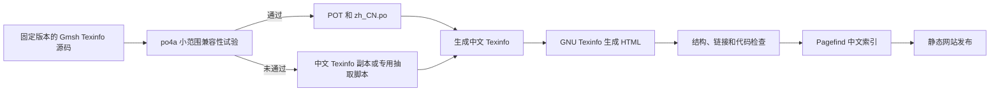

# Gmsh 中文文档网站实施方案

- 状态：调研记录；最终决定见 [`docs/design/translation-plan.md`](../design/translation-plan.md) 和 [`docs/adr/`](../adr/)
- 核验日期：2026-08-12
- 首个目标版本：Gmsh 4.15.2
- 目标语言：简体中文（`zh-CN`）

> 本文保留早期事实核验和选型过程，不再作为实施规范。若本文与最终方案或 ADR 不同，以最终方案和已接受的 ADR 为准。尤其是人工技术复核、手工维护中文 Texinfo 备用源、域名根目录资源路径及“取得版权方确认后才发布”等早期建议，均已被后续决定取代。

## 1. 建议结论

这个项目适合使用开源工具，而且没有必要购买商业文档平台。建议把 Gmsh 的 Texinfo 源文件继续作为文档结构来源，用 GNU Texinfo 生成 HTML；翻译内容优先放入 PO 文件，但要先验证 po4a 能否无损处理 Gmsh 手册。站内搜索可以使用 Pagefind，多人参与后再部署 Weblate。

第一阶段不应立即翻译整本手册。先选择三类内容做试验：普通说明文字、带代码和交叉引用的教程、API 条目。只有在 Texinfo 结构、锚点、代码和链接均能完整保留后，才把 po4a 纳入正式构建流程。

当前仓库的 MIT `LICENSE` 只适合覆盖本项目自行编写的脚本和页面样式，不能直接覆盖 Gmsh 原文及其中文翻译。公开发布前需要单独处理 Gmsh 文档的版权和许可说明。

## 2. 上游基线

[Gmsh 官方主页](https://gmsh.info/)显示，当前稳定版是 4.15.2，发布日期为 2026 年 3 月 24 日。首个中文版本应固定在这个发布版，不跟随每日变化的开发分支。官方参考手册也明确标注为 [Gmsh 4.15.2 Reference Manual](https://gmsh.info/doc/texinfo/gmsh.html)。

手册主源文件位于官方源码仓库的 [`doc/texinfo/gmsh.texi`](https://gitlab.onelab.info/gmsh/gmsh/-/blob/gmsh_4_15_2/doc/texinfo/gmsh.texi)，并通过 `@include`、`@verbatiminclude` 等命令引用 API、选项、插件、网格场和许可证等其他文件。官方 [`CMakeLists.txt`](https://gitlab.onelab.info/gmsh/gmsh/-/blob/gmsh_4_15_2/CMakeLists.txt) 使用 `makeinfo` 生成 HTML、Info 和纯文本，并使用 `texi2pdf` 生成 PDF。GNU Texinfo 官方文档确认，`texi2any --html` 或其兼容命令 `makeinfo --html` 可以直接生成网页，并支持 CSS 和初始化文件定制输出。[GNU Texinfo：Generating HTML](https://www.gnu.org/software/texinfo/manual/texinfo/html_node/Generating-HTML.html)

建议提交一份 `upstream/manifest.toml`，记录以下信息：

- Gmsh 版本和正式发布标签；
- 完整提交哈希；
- 官方源码包下载地址；
- 源码包 SHA-256；
- 获取日期；
- 构建所用 Texinfo、po4a 和 Pagefind 版本。

构建脚本按清单下载并校验源码，不把整个 Gmsh 仓库复制进本项目。这样既能复现旧版本，也能避免中文仓库长期携带大量无关源码。

## 3. 推荐的处理流程



po4a 的设计很适合持续维护文档翻译：它把可翻译文本抽取成 PO，再把译文放回原有文档结构。不过，po4a 官方手册仍将 Texinfo 解析器标为“very highly experimental”，并说明相关支持尚处在早期阶段。因此，po4a 是优先试验的方案，目前不应成为没有备用路径的唯一依赖。[po4a 官方手册](https://www.po4a.org/man/man7/po4a.7.php)

### po4a 试验通过时

翻译以 `po/zh_CN.po` 为主要工作文件。上游更新后重新生成 POT，再用 GNU gettext 的 `msgmerge` 合并已有译文。未变化的段落可以复用；变化较小的段落会标记为 `fuzzy`，必须经过人工复核；新增内容保持未翻译状态。[GNU gettext 对 PO 更新的说明](https://www.gnu.org/software/gettext/manual/html_node/Files.html)

po4a 配置大致如下，实际文件清单要在试验阶段根据 `@include` 关系补齐：

```ini
[po4a_langs] zh_CN
[po4a_paths] po/gmsh.pot $lang:po/$lang.po

[type:texinfo] upstream/gmsh/doc/texinfo/gmsh.texi \
    $lang:build/$lang/gmsh.texi
```

### po4a 试验未通过时

先维护一套中文 Texinfo 源文件，所有 Texinfo 命令、节点名、锚点和代码保持与上游一致，只翻译自然语言内容。每次更新通过 Git 差异定位原文变化。这条路径自动化程度较低，但结构最可控，可以先完成可用版本。

如果后续维护成本明显上升，再编写只处理 Gmsh 所用 Texinfo 子集的抽取与回填脚本。脚本仍可输出 PO，因此无需放弃 gettext、OmegaT 或 Weblate。专用脚本必须配套往返测试，确保“抽取后原样回填”不会改变源文件结构。

## 4. 开源工具选择

| 工具 | 是否首期需要 | 用途 | 说明 |
| --- | --- | --- | --- |
| Git | 需要 | 版本管理、上游差异和译文审查 | 所有译文、术语和构建脚本都纳入版本控制 |
| GNU Texinfo | 需要 | 从 `.texi` 生成 HTML | 沿用 Gmsh 官方构建方式，避免格式转换造成结构损失 |
| po4a | 先试验 | Texinfo 与 PO 之间抽取、回填 | Texinfo 解析器仍属高度实验性，必须设置通过条件和备用路径 |
| GNU gettext | 使用 PO 时需要 | `msgmerge`、`msgfmt` 和 PO 校验 | 负责译文更新和格式检查，不负责解析 Texinfo |
| OmegaT | 个人翻译时可选 | 翻译记忆、术语表、模糊匹配 | OmegaT 是自由软件，也明确说明它本身不会自动完成翻译；适合本地编辑和积累翻译记忆。[OmegaT 官方说明](https://omegat.org/) |
| Weblate | 多人协作后再用 | 在线翻译、审校、权限和 Git 回写 | Weblate 支持 PO/POT，并可从 POT 更新 PO；也支持 Git 和主流代码托管平台。[PO 支持](https://docs.weblate.org/en/latest/formats/gettext.html)、[版本控制集成](https://docs.weblate.org/en/latest/vcs.html) |
| Pagefind Extended | 网站可用后加入 | 无服务器的中文全文搜索 | Pagefind 根据 HTML 的 `lang` 属性建立分语言索引；extended 版本支持中文分词，`npx pagefind` 默认使用该版本。[多语言搜索](https://pagefind.app/docs/multilingual/)、[安装方式](https://pagefind.app/docs/installation/) |
| Docker Engine 或 Podman | 建议 | 固定构建环境 | Windows 本地、Linux CI 和服务器使用同一工具版本，减少环境差异 |

首期最小组合是 Git、容器运行环境和 GNU Texinfo。po4a 通过试验后，再加入 gettext 和 PO。Pagefind、OmegaT、Weblate 都能后加，不影响早期目录和构建方式。

不建议先把 Texinfo 转成 Markdown，再交给 MkDocs、Docusaurus 或 VitePress。Gmsh 手册包含大量节点、交叉引用、索引、API 条目和 Texinfo 命令，多一次格式转换就多一处结构丢失或上游同步失败的可能。站点只需要在 Texinfo HTML 外增加一层很薄的导航、版本信息和搜索界面。

## 5. 仓库目录设计

```text
gmsh-doc-cn/
├─ README.md
├─ LICENSE                         # 本项目自有脚本和样式的许可证
├─ NOTICE.md                       # 上游版权、非官方翻译和变更说明
├─ LICENSES/
│  └─ Gmsh-license.txt             # 从固定版本复制的上游许可文本
├─ upstream/
│  └─ manifest.toml                # 版本、标签、提交、下载地址和校验值
├─ po/
│  ├─ gmsh.pot
│  └─ zh_CN.po
├─ glossary/
│  └─ terms.csv                    # 术语、推荐译法、禁用译法和说明
├─ config/
│  ├─ po4a.cfg
│  └─ texi2any-init.pl             # 需要时定制 HTML
├─ site/
│  ├─ index.html                   # 版本入口
│  └─ assets/
│     ├─ gmsh-cn.css
│     └─ site.js
├─ scripts/
│  ├─ fetch-upstream.sh
│  ├─ build.sh
│  ├─ update-upstream.sh
│  └─ validate.py
├─ tests/
│  ├─ test_structure.py
│  └─ fixtures/
├─ docs/
│  └─ research/
│     └─ gmsh-cn-site-research.md
├─ build/                          # 生成文件，不提交
├─ dist/                           # 发布文件，不提交
└─ .github/
   └─ workflows/
      ├─ check.yml
      └─ publish.yml
```

如果需要在 Windows 上直接运行而不依赖 WSL，可以把三个 `.sh` 脚本换成跨平台 Python 入口；Texinfo 和 po4a 仍放在 Docker 容器中执行。

## 6. 网站地址和页面设计

建议保留官方单页手册形式作为兼容入口，并按版本和语言组织地址：

```text
/                              版本与语言入口
/v4.15.2/zh-cn/gmsh.html       中文单页手册
/v4.15.2/en/gmsh.html          对应英文手册
/latest/zh-cn/                 指向最新已发布中文版本
/assets/                       公共样式和脚本
/pagefind/                     搜索索引
```

页面顶部增加一条固定但克制的工具栏，包含“非官方简体中文翻译”、Gmsh 版本、语言切换、原文链接和搜索入口。正文保留 Texinfo 生成的目录、标题层级和锚点。页脚列出上游版本、提交哈希、翻译更新时间、翻译进度、问题反馈地址和许可证入口。

首个版本继续生成与官方相近的 `--no-split` 单页，便于比较锚点和内容。若单页加载或搜索体验不理想，可以再增加按章拆分的阅读入口，但不删除 `gmsh.html` 兼容地址。

## 7. 翻译规则

以下内容保持原样：

- `@node`、锚点、交叉引用目标和 Texinfo 控制命令；
- C++、C、Python、Julia、Fortran 的 API 名称；
- Gmsh 选项名、命令行参数、文件格式字段和示例文件名；
- 代码块、数学公式、数值和单位；
- 外部链接及上游源码链接。

以下内容可以翻译：

- 章节标题和正文说明；
- 图表标题、注释、提示和错误解释；
- API 参数的自然语言说明；
- 索引中的自然语言概念，但索引键和链接关系必须保持稳定。

术语表至少应包含英文术语、推荐中文、允许保留英文的场景、说明和审校状态。例如 `mesh` 可根据语境译为“网格”，`entity` 在几何语境中统一译为“实体”，API 标识符中的同名词仍保留英文。术语修改需要单独审查，避免整本手册出现多套译法。

机器翻译只能提供初稿建议，不进入无人审查的自动发布流程。API、脚本语言、文件格式和算法章节至少需要一名熟悉 Gmsh 的人员复核。

## 8. 构建与检查

在 po4a 路线通过试验后，核心命令可以整理为：

```bash
po4a --verbose config/po4a.cfg
msgfmt --check --check-compatibility -o /dev/null po/zh_CN.po
makeinfo --html --no-split \
  --css-ref=/assets/gmsh-cn.css \
  --output=dist/v4.15.2/zh-cn/gmsh.html \
  build/zh_CN/gmsh.texi
npx pagefind@<固定版本> --site dist
```

正式构建至少检查以下内容：

1. `makeinfo` 无错误退出，重要警告视为失败；
2. 中英文 HTML 的章节锚点集合一致；
3. 所有内部链接都能找到目标；
4. 代码块数量和内容与上游一致；
5. API 名、选项名和命令行参数未被意外翻译；
6. PO 文件通过 `msgfmt --check`；
7. 页面使用 `<html lang="zh-CN">`，Pagefind 能返回中文结果；
8. 页面展示准确的版本、上游提交和翻译日期；
9. 未审校或已经落后于上游的内容有明确标记。

CI 在每个合并请求中完成下载校验、翻译生成、HTML 构建、结构比较和链接检查。只有主分支通过全部检查后才发布静态站点。当前仓库托管在 GitHub，首选 GitHub Actions 和 GitHub Pages；如果希望全部服务自行托管，可以使用 Forgejo 或 Gitea、Woodpecker CI 和 Nginx，文档生成方式无需变化。

## 9. 分阶段实施

### 阶段一：来源和许可确认

- 固定 Gmsh 4.15.2，建立 `upstream/manifest.toml`；
- 保存官方许可文本和版权信息；
- 向 Gmsh 作者确认手册翻译及公开发布方式，尤其确认手册标题页的复制许可与 GPL 文本之间的适用关系；
- 明确本项目自有代码和翻译内容分别使用什么许可。

完成标准：任何访问者都能看出中文站点与 Gmsh 官方项目的关系、版本来源、修改日期和许可条件。

### 阶段二：po4a 兼容性试验

- 选择 Overview、教程 `t1` 和一段 API 文档；
- 做一次无翻译的抽取与回填，比较输入和输出结构；
- 翻译少量内容并生成 HTML；
- 检查节点、锚点、交叉引用、代码、索引和 include 文件；
- 把结果记录为“通过”或“改用备用方案”。

完成标准：生成的 Texinfo 和 HTML 可以稳定复现，受保护内容没有变化，失败时能自动阻止发布。

### 阶段三：可访问的最小版本

- 建立站点首页、中文工具栏、版本信息和原文链接；
- 完成 Overview 与基础教程的翻译和审校；
- 接入 Pagefind 中文搜索；
- 建立自动构建和预览；
- 发布 `/v4.15.2/zh-cn/gmsh.html`。

完成标准：网站可以公开访问，导航、锚点、搜索和许可证入口正常，未翻译内容有清楚说明。

### 阶段四：扩大翻译和协作

- 按教程、脚本语言、API、选项、文件格式的顺序推进；
- 使用 OmegaT 维护个人翻译记忆，或在参与者增多后部署 Weblate；
- 为技术章节设置译者和审校者；
- 在首页显示总体和分章节进度。

### 阶段五：跟随上游更新

- 定期检查 Gmsh 正式发布标签，不自动追踪开发分支；
- 新版本进入独立目录，旧版本继续保留；
- 生成新的 POT 并合并已有 PO；
- 对 `fuzzy`、新增和删除段落进行人工复核；
- 结构检查和审校完成后再修改 `/latest/zh-cn/`。

## 10. 主要风险

### Texinfo 解析风险

po4a 已明确把 Texinfo 支持标为高度实验性。解决办法是先做小范围往返试验、保留并行中文 Texinfo 的备用路径，并让构建检查锚点和代码是否发生变化。

### 许可边界不清

Gmsh 官方主页说明软件按 GPL 2.0 或更高版本并附链接例外发布，GPL 文本把翻译视作修改；手册源文件同时包含逐字复制手册的许可措辞。两者对手册翻译的具体适用关系需要在发布前向版权方确认。本方案只给出工程上的保守处理建议，不构成法律意见。[Gmsh 许可说明](https://gmsh.info/#Licensing)、[Gmsh 完整许可证文本](https://gmsh.info/LICENSE.txt)

### 技术内容被误译

代码、API、选项、文件格式字段和算法名容易被机器翻译破坏。需要术语表、受保护标记、自动比较和人工审校共同控制。

### 中文版本落后

网站必须显示对应的 Gmsh 版本和翻译日期。不能用旧译文覆盖新原文；PO 中的 `fuzzy` 条目只能在复核后发布为已翻译状态。

## 11. 推荐的下一项工作

先实现“阶段二”的最小试验仓库：固定 Gmsh 4.15.2，准备容器化的 Texinfo/po4a/gettext 环境，抽取 Overview、`t1` 和一个 API 小节，建立第一组结构检查。试验结果将决定正式翻译内容存放在 PO 还是中文 Texinfo 中，后面的目录和网站设计无需推倒重来。
